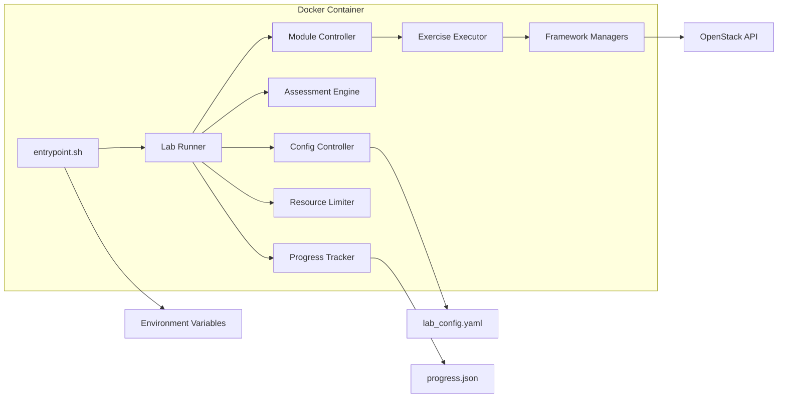
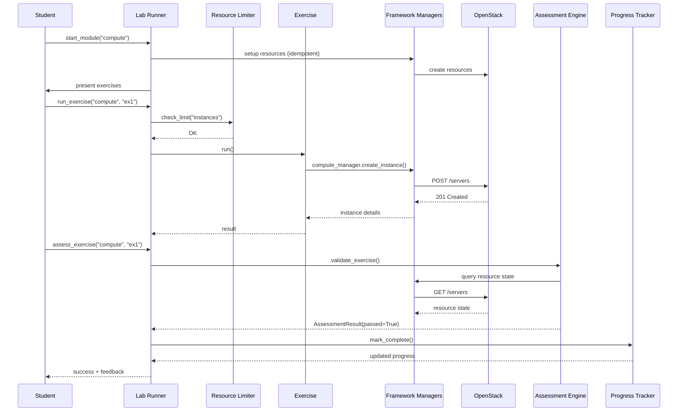
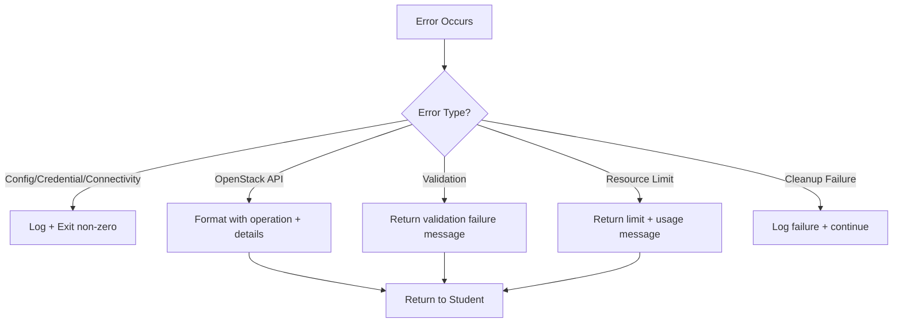

# Design Document: OpenStack First Steps Labs

## Overview

The OpenStack First Steps Labs platform is a containerized, hands-on learning environment that teaches OpenStack fundamentals through progressive, modular lab exercises. It integrates with the existing `opcp-openstack-automation` framework, reusing its proven manager components (auth, compute, network, volume, security groups) to interact with OpenStack APIs.

The platform follows a layered architecture:

1. A **Lab Runner** layer that orchestrates module lifecycle (setup, exercise execution, assessment, cleanup)
2. A **Module** layer containing 6 independent lab modules, each with exercises, solutions, and setup scripts
3. An **Infrastructure** layer handling container deployment, configuration, resource limits, and credential management
4. An **Integration** layer bridging exercises to the existing automation framework managers

Students interact with exercises as Python scripts that call framework managers. An assessment engine validates work by querying actual OpenStack resource state. Progress is tracked per-student and persisted across container restarts.

```mermaid
graph TB
    subgraph Lab Container
        subgraph Lab Runner
            CLI[Lab CLI / Runner]
            AE[Assessment Engine]
            PT[Progress Tracker]
            RL[Resource Limiter]
        end
        subgraph Modules
            FS[first_steps]
            AU[authentication]
            CO[compute]
            NE[networking]
            ST[storage]
            SG[security_groups]
        end
        subgraph Integration Layer
            AM[auth_manager]
            CM[compute_manager]
            NM[network_manager]
            VM[volume_manager]
            SM[security_group_manager]
        end
    end
    subgraph External
        OS[OpenStack Cloud]
        CFG[lab_config.yaml]
        PROG[progress.json]
    end

    CLI --> AE
    CLI --> PT
    CLI --> RL
    CLI --> Modules
    Modules --> Integration Layer
    Integration Layer --> OS
    CLI --> CFG
    PT --> PROG
```

## Architecture

### High-Level Architecture

The platform uses a modular, layered architecture deployed inside a Docker container.



### Directory Structure

```
labs/
├── base/
│   ├── Dockerfile
│   ├── entrypoint.sh
│   └── requirements.txt
├── modules/
│   ├── first_steps/
│   │   ├── README.md
│   │   ├── exercises/
│   │   │   ├── exercise_1_create_instance.py
│   │   │   ├── exercise_2_create_network.py
│   │   │   └── exercise_3_create_volume.py
│   │   ├── solutions/
│   │   │   ├── exercise_1_solution.py
│   │   │   ├── exercise_2_solution.py
│   │   │   └── exercise_3_solution.py
│   │   └── setup/
│   │       └── setup_environment.py
│   ├── authentication/
│   │   ├── README.md
│   │   ├── exercises/
│   │   ├── solutions/
│   │   └── setup/
│   ├── compute/
│   │   ├── README.md
│   │   ├── exercises/
│   │   ├── solutions/
│   │   └── setup/
│   ├── networking/
│   │   ├── README.md
│   │   ├── exercises/
│   │   ├── solutions/
│   │   └── setup/
│   ├── storage/
│   │   ├── README.md
│   │   ├── exercises/
│   │   ├── solutions/
│   │   └── setup/
│   └── security_groups/
│       ├── README.md
│       ├── exercises/
│       ├── solutions/
│       └── setup/
├── templates/
│   ├── exercise_template.py
│   └── assessment_template.py
├── scripts/
│   ├── setup_lab.py
│   ├── cleanup_lab.py
│   └── validate_exercise.py
├── config/
│   ├── lab_config.yaml
│   └── lab_config.example.yaml
├── core/
│   ├── __init__.py
│   ├── runner.py
│   ├── assessment.py
│   ├── progress.py
│   ├── resource_limiter.py
│   ├── config_loader.py
│   └── credential_handler.py
└── tests/
    ├── test_assessment.py
    ├── test_progress.py
    ├── test_resource_limiter.py
    ├── test_config_loader.py
    └── test_credential_handler.py
```

### Key Design Decisions

| Decision | Choice | Rationale |
|---|---|---|
| Language | Python | Matches existing automation framework; OpenStack SDKs are Python-native |
| Config format | YAML (`lab_config.yaml`) | Human-readable, widely used in DevOps tooling, matches requirement 15 |
| Progress storage | JSON file (`progress.json`) | Simple, portable, survives container restarts via volume mount |
| Assessment approach | Query OpenStack resource state | Validates actual outcomes, not source code (requirement 11.4) |
| Resource isolation | Naming conventions with student prefix | Simpler than per-student projects; works with single-project deployments |
| Credential handling | Environment variables + optional secure file | Standard container pattern; avoids CLI args (requirement 16.1) |

## Components and Interfaces

### 1. Config Loader (`core/config_loader.py`)

Responsible for loading and validating `lab_config.yaml`.

```python
class LabConfig:
    """Immutable configuration loaded from lab_config.yaml."""
    openstack_endpoint: str
    default_flavor: str
    default_image: str
    module_order: list[str]
    resource_limits: ResourceLimits
    session_timeout: int

class ResourceLimits:
    max_instances: int
    max_networks: int
    max_volumes: int
    max_security_groups: int

def load_config(config_path: str = "config/lab_config.yaml") -> LabConfig:
    """Load and validate lab configuration. Raises ConfigError on invalid YAML or missing file."""

def validate_config(raw: dict) -> LabConfig:
    """Validate raw YAML dict against expected schema. Raises ConfigError on validation failure."""
```

### 2. Credential Handler (`core/credential_handler.py`)

Manages secure credential loading and masking.

```python
class Credentials:
    auth_url: str
    username: str
    password: str  # never logged
    project_name: str
    domain_name: str

def load_credentials() -> Credentials:
    """Load credentials from environment variables or secure config file. Raises CredentialError if missing."""

def mask_value(value: str) -> str:
    """Mask a credential value for safe logging. Returns '****' + last 4 chars."""
```

### 3. Resource Limiter (`core/resource_limiter.py`)

Enforces per-student resource caps.

```python
class ResourceLimiter:
    def __init__(self, limits: ResourceLimits, student_id: str): ...

    def check_limit(self, resource_type: str, current_count: int) -> None:
        """Raise ResourceLimitError if creating one more resource would exceed the limit."""

    def get_usage(self, resource_type: str) -> dict:
        """Return current usage and limit for a resource type."""
```

### 4. Assessment Engine (`core/assessment.py`)

Validates exercise solutions by querying OpenStack state.

```python
class AssessmentResult:
    passed: bool
    exercise_id: str
    feedback: str
    expected_outcomes: list[str]
    actual_outcomes: list[str]

class AssessmentEngine:
    def __init__(self, managers: dict, progress_tracker: ProgressTracker): ...

    def validate_exercise(self, module_name: str, exercise_id: str, student_id: str) -> AssessmentResult:
        """Validate an exercise by querying OpenStack resource state against expected outcomes."""

    def _check_resource_exists(self, resource_type: str, resource_name: str) -> bool:
        """Check if a named resource exists in OpenStack."""

    def _check_resource_properties(self, resource_type: str, resource_name: str, expected: dict) -> list[str]:
        """Check resource properties match expected values. Returns list of mismatches."""
```

### 5. Progress Tracker (`core/progress.py`)

Records and persists student progress.

```python
class ExerciseStatus:
    exercise_id: str
    completed: bool
    completed_at: str | None

class ModuleProgress:
    module_name: str
    exercises: dict[str, ExerciseStatus]
    completed: bool

class ProgressTracker:
    def __init__(self, storage_path: str = "progress.json"): ...

    def mark_complete(self, student_id: str, module_name: str, exercise_id: str) -> None:
        """Mark an exercise as completed. Updates module completion if all exercises done."""

    def get_progress(self, student_id: str) -> dict[str, ModuleProgress]:
        """Return progress summary for a student across all modules."""

    def is_module_complete(self, student_id: str, module_name: str) -> bool:
        """Check if all exercises in a module are completed."""

    def _save(self) -> None:
        """Persist progress data to JSON file."""

    def _load(self) -> None:
        """Load progress data from JSON file."""
```

### 6. Exercise Base Class (`templates/exercise_template.py`)

Standardized template all exercises inherit from.

```python
class Exercise:
    """Base class for all lab exercises."""

    def __init__(self, module_name: str, exercise_id: str, managers: dict): ...

    @property
    def problem_statement(self) -> str:
        """Return the exercise problem statement."""

    @property
    def instructions(self) -> list[str]:
        """Return step-by-step instructions."""

    @property
    def expected_outcomes(self) -> list[dict]:
        """Return expected outcomes for assessment validation."""

    def run(self, **kwargs) -> dict:
        """Execute the exercise. Subclasses implement this."""

    def verify(self) -> AssessmentResult:
        """Verify the exercise solution against expected outcomes."""

    def _handle_openstack_error(self, operation: str, error: Exception) -> str:
        """Format a descriptive error message including operation and error details."""
```

### 7. Setup and Cleanup Scripts (`scripts/`)

```python
# setup_lab.py
class LabSetup:
    def __init__(self, config: LabConfig, managers: dict, student_id: str): ...

    def setup_module(self, module_name: str) -> None:
        """Provision all required OpenStack resources for a module. Idempotent."""

    def _resource_exists(self, resource_type: str, name: str) -> bool:
        """Check if a resource already exists (for idempotency)."""

# cleanup_lab.py
class LabCleanup:
    def __init__(self, managers: dict, student_id: str): ...

    def cleanup_module(self, module_name: str) -> list[str]:
        """Delete all resources for a module. Returns list of failed deletions."""

    def cleanup_all(self) -> list[str]:
        """Delete all resources for the student session. Continues on individual failures."""

    def revoke_session_tokens(self) -> None:
        """Revoke any session-scoped tokens created during the session."""
```

### 8. Lab Runner (`core/runner.py`)

Top-level orchestrator.

```python
class LabRunner:
    def __init__(self, config: LabConfig, credentials: Credentials): ...

    def start_module(self, module_name: str, student_id: str) -> None:
        """Setup module environment and present exercises."""

    def run_exercise(self, module_name: str, exercise_id: str, student_id: str, **kwargs) -> dict:
        """Execute an exercise with resource limit checks."""

    def assess_exercise(self, module_name: str, exercise_id: str, student_id: str) -> AssessmentResult:
        """Validate exercise and update progress."""

    def end_session(self, student_id: str) -> None:
        """Cleanup resources and revoke tokens."""

    def get_progress(self, student_id: str) -> dict:
        """Return student progress summary."""
```

### Component Interaction Flow



## Data Models

### Lab Configuration (`lab_config.yaml`)

```yaml
openstack:
  endpoint: "https://cloud.example.com:5000/v3"
  default_flavor: "m1.small"
  default_image: "ubuntu-22.04"

modules:
  order:
    - first_steps
    - authentication
    - compute
    - networking
    - storage
    - security_groups

session:
  timeout_minutes: 120
  resource_limits:
    max_instances: 3
    max_networks: 2
    max_volumes: 3
    max_security_groups: 5
```

### Progress Data (`progress.json`)

```json
{
  "students": {
    "student-001": {
      "modules": {
        "first_steps": {
          "exercises": {
            "exercise_1_create_instance": {
              "completed": true,
              "completed_at": "2024-01-15T10:30:00Z"
            },
            "exercise_2_create_network": {
              "completed": false,
              "completed_at": null
            }
          },
          "completed": false
        }
      }
    }
  }
}
```

### Exercise Definition (per exercise file)

Each exercise Python file defines:

```python
# exercises/exercise_1_create_instance.py
from templates.exercise_template import Exercise

class CreateInstanceExercise(Exercise):
    @property
    def problem_statement(self) -> str:
        return "Create a compute instance using the Nova API."

    @property
    def instructions(self) -> list[str]:
        return [
            "Use compute_manager to create an instance",
            "Name it '{student_id}-first-instance'",
            "Use the default flavor and image from config",
        ]

    @property
    def expected_outcomes(self) -> list[dict]:
        return [
            {"type": "instance", "name": "{student_id}-first-instance", "status": "ACTIVE"}
        ]

    def run(self, **kwargs) -> dict:
        # Student implements this
        pass
```

### Assessment Result

```python
@dataclass
class AssessmentResult:
    passed: bool
    exercise_id: str
    feedback: str
    expected_outcomes: list[dict]  # what should exist
    actual_outcomes: list[dict]    # what was found
    mismatches: list[str]          # human-readable diff
```

### Credential Sources (priority order)

1. Environment variables: `OS_AUTH_URL`, `OS_USERNAME`, `OS_PASSWORD`, `OS_PROJECT_NAME`, `OS_DOMAIN_NAME`
2. Secure config file: `~/.openstack/credentials.yaml` (file permissions checked)


## Correctness Properties

*A property is a characteristic or behavior that should hold true across all valid executions of a system — essentially, a formal statement about what the system should do. Properties serve as the bridge between human-readable specifications and machine-verifiable correctness guarantees.*

### Property 1: Module Structure Validity

*For any* module name in the set of valid lab modules, the module directory SHALL contain an `exercises/` directory, a `solutions/` directory, a `setup/` directory, and a `README.md` file.

**Validates: Requirements 1.2**

### Property 2: Exercise Template Conformance

*For any* Exercise subclass instance, it SHALL be a subclass of the Exercise base class and SHALL have non-empty `problem_statement`, `instructions`, and `expected_outcomes` properties, and a callable `verify` method.

**Validates: Requirements 2.1, 2.3**

### Property 3: Error Message Formatting

*For any* operation name string and error detail string, the formatted error message produced by `_handle_openstack_error` SHALL contain both the operation name and the error details.

**Validates: Requirements 2.4**

### Property 4: CIDR Validation

*For any* valid CIDR string (e.g., "10.0.0.0/24"), the CIDR validator SHALL accept it. *For any* invalid CIDR string (malformed, out-of-range prefix, non-numeric octets), the validator SHALL reject it and return an error describing the validation failure.

**Validates: Requirements 6.4**

### Property 5: Security Group Rule Validation

*For any* invalid protocol or port range combination (unknown protocol, port outside 1-65535, start > end), the security group rule validator SHALL reject it and return an error describing the validation failure. *For any* valid combination, it SHALL accept it.

**Validates: Requirements 8.4**

### Property 6: Cleanup Resilience

*For any* list of resources where a random subset of deletions fail, the cleanup process SHALL attempt to delete every resource in the list, log each failure with the resource identifier and failure reason, and continue processing remaining resources.

**Validates: Requirements 10.3**

### Property 7: Setup Idempotency

*For any* module, running `setup_module()` twice with the same configuration SHALL produce the same environment state — the second invocation SHALL not create duplicate resources.

**Validates: Requirements 10.4**

### Property 8: Assessment Correctness

*For any* set of expected outcomes and actual OpenStack resource states, the Assessment Engine SHALL return `passed=True` when all expected outcomes match actual state (and mark the exercise complete in the Progress Tracker), and SHALL return `passed=False` with feedback listing all unmet outcomes when any expected outcome does not match.

**Validates: Requirements 11.1, 11.2, 11.3**

### Property 9: Progress Tracking and Module Completion

*For any* student ID, module name, and set of N exercise IDs, marking all N exercises as complete SHALL result in the module being marked complete. Marking fewer than N exercises as complete SHALL NOT result in the module being marked complete. Each individual mark-complete followed by a progress query SHALL show that exercise as completed.

**Validates: Requirements 3.5, 12.1, 12.3**

### Property 10: Progress Persistence Round-Trip

*For any* progress state (arbitrary combination of students, modules, and exercise completion statuses), serializing to JSON and deserializing back SHALL produce an equivalent progress state.

**Validates: Requirements 12.4**

### Property 11: Resource Limit Enforcement

*For any* resource type, configured limit L, and current count C: when C < L, the resource limiter SHALL allow creation; when C >= L, the resource limiter SHALL reject creation and return a message containing both the limit value L and the current usage C.

**Validates: Requirements 14.1, 14.2**

### Property 12: Resource Name Isolation

*For any* student ID and resource base name, the generated isolated resource name SHALL contain the student ID as a prefix, ensuring that resources from different students have distinct names.

**Validates: Requirements 14.3**

### Property 13: Configuration Validation

*For any* invalid YAML string (malformed syntax, missing required fields, wrong types), the config loader SHALL raise a `ConfigError` with a descriptive message. *For any* valid YAML configuration, the loader SHALL return a correctly populated `LabConfig` object.

**Validates: Requirements 15.3**

### Property 14: Credential Masking

*For any* credential string of length >= 4, the masked output SHALL NOT equal the original string and SHALL hide all but the last 4 characters. *For any* credential string of length < 4, the masked output SHALL be fully masked (e.g., "****").

**Validates: Requirements 16.2**

## Error Handling

### Error Categories and Responses

| Error Category | Source | Handling Strategy | User-Facing Message |
|---|---|---|---|
| **Configuration Error** | Missing/invalid `lab_config.yaml` | Exit with non-zero code, log descriptive error | "Configuration error: {details}. Check lab_config.yaml." |
| **Credential Error** | Missing env vars or config file | Exit with non-zero code, log (masked) error | "Credentials not found. Set OS_* environment variables or provide credentials.yaml." |
| **Connectivity Error** | Unreachable OpenStack endpoint | Exit with non-zero code, log endpoint URL and error | "Cannot reach OpenStack endpoint at {url}: {error}" |
| **Authentication Error** | Invalid credentials | Return error to student, do not exit | "Authentication failed: {reason}. Check your credentials." |
| **Resource Limit Error** | Exceeding configured limits | Reject operation, return limit info | "Resource limit exceeded: {current}/{limit} {resource_type}. Cannot create more." |
| **OpenStack API Error** | Any API call failure | Catch, format with operation + details, return to student | "Operation '{operation}' failed: {error_details}" |
| **Validation Error** | Invalid CIDR, protocol, port range | Reject input, return validation details | "Validation failed: {field} — {reason}" |
| **Cleanup Failure** | Resource deletion fails | Log failure, continue with remaining resources | Logged: "Failed to delete {resource_type} {resource_id}: {reason}" |
| **Assessment Error** | Cannot query resource state | Return assessment failure with details | "Assessment could not verify: {reason}" |

### Error Handling Principles

1. **Never crash on student errors** — OpenStack API errors, validation errors, and assessment failures return descriptive messages to the student. The platform continues running.
2. **Fail fast on infrastructure errors** — Missing config, missing credentials, and connectivity failures cause immediate exit with non-zero code and descriptive logs.
3. **Never log credentials** — All credential values are masked before logging using `mask_value()`.
4. **Cleanup is best-effort** — Individual resource deletion failures are logged but do not stop the cleanup of remaining resources.
5. **Errors include context** — Every error message includes the operation attempted and the specific failure reason.

### Error Flow



## Testing Strategy

### Testing Approach

The testing strategy uses a dual approach: **property-based tests** for universal correctness guarantees across the core logic, and **example-based unit/integration tests** for specific scenarios, content verification, and external service interactions.

### Property-Based Tests

**Library:** [Hypothesis](https://hypothesis.readthedocs.io/) (Python)

Each property test maps to a Correctness Property from this design document. All property tests run a minimum of 100 iterations.

| Property | Test Target | Key Generators |
|---|---|---|
| P1: Module Structure | Directory scanner | Module names from valid set |
| P2: Exercise Conformance | Exercise subclasses | Random Exercise instances |
| P3: Error Formatting | `_handle_openstack_error()` | Random operation + error strings |
| P4: CIDR Validation | CIDR validator function | Valid/invalid CIDR strings |
| P5: SG Rule Validation | Rule validator function | Random protocol/port combinations |
| P6: Cleanup Resilience | `LabCleanup` with mocked managers | Resource lists with random failures |
| P7: Setup Idempotency | `LabSetup` with mocked managers | Module names, run setup twice |
| P8: Assessment Correctness | `AssessmentEngine` with mocked managers | Expected outcomes + matching/non-matching states |
| P9: Progress Tracking | `ProgressTracker` | Random student/module/exercise combinations |
| P10: Progress Persistence | `ProgressTracker._save()/_load()` | Random progress state dicts |
| P11: Resource Limits | `ResourceLimiter.check_limit()` | Random counts and limits |
| P12: Resource Name Isolation | Resource naming function | Random student IDs + resource names |
| P13: Config Validation | `load_config()` / `validate_config()` | Valid/invalid YAML strings and dicts |
| P14: Credential Masking | `mask_value()` | Random credential strings of varying length |

**Tag format:** `# Feature: openstack-first-steps-labs, Property {N}: {title}`

### Example-Based Unit Tests

| Test Area | What's Verified | Requirements |
|---|---|---|
| Module content — first_steps | Contains create-instance, create-network, create-volume exercises | 3.1, 3.2, 3.3 |
| Module content — first_steps README | README explains core concepts | 3.4 |
| Module content — authentication | Contains auth + token management exercises | 4.1, 4.2 |
| Module content — compute | Contains launch, resize, snapshot exercises | 5.1, 5.2, 5.3 |
| Module content — networking | Contains network, subnet, router exercises | 6.1, 6.2, 6.3 |
| Module content — storage | Contains volume, attach, snapshot exercises | 7.1, 7.2, 7.3 |
| Module content — security_groups | Contains create-sg, manage-rules, apply-sg exercises | 8.1, 8.2, 8.3 |
| Auth failure error | Invalid credentials return clear error | 4.3 |
| Config loading | Known config values are read correctly | 15.1, 15.2 |
| Config example file | Example file exists with all parameters | 15.4 |
| Credential sources | Credentials loaded from env vars or file, not CLI | 16.1 |
| HTTPS enforcement | HTTPS used when endpoint supports TLS | 16.4 |

### Integration Tests

| Test Area | What's Verified | Requirements |
|---|---|---|
| Module independence | Each module deploys and runs without others | 1.3 |
| Framework manager usage | Exercises call correct managers | 2.2, 13.1–13.5 |
| Container build | Dockerfile builds successfully with all deps | 9.1 |
| Requirements.txt | All deps pinned | 9.2 |
| Entrypoint connectivity | Entrypoint validates OpenStack connectivity | 9.3 |
| Connectivity failure | Container exits non-zero on unreachable endpoint | 9.4 |
| Cross-platform | Container runs on Linux, macOS, Windows | 9.5 |
| Setup provisioning | Setup creates expected resources | 10.1 |
| Cleanup deletion | Cleanup removes all session resources | 10.2 |
| Assessment queries state | Assessment uses OpenStack queries, not source code | 11.4 |
| Token revocation | Session end revokes tokens | 16.3 |
| Skillhub structure | Directory structure matches skillhub pattern | 13.6 |

### Smoke Tests

| Test Area | What's Verified | Requirements |
|---|---|---|
| Module directories exist | All 6 modules present | 1.1 |
| Module order in config | Config contains module progression order | 1.4 |
| Docker image contents | Image has framework, modules, deps | 9.1 |
| Requirements pinned | requirements.txt has pinned versions | 9.2 |
| Example config | lab_config.example.yaml exists with defaults | 15.4 |
